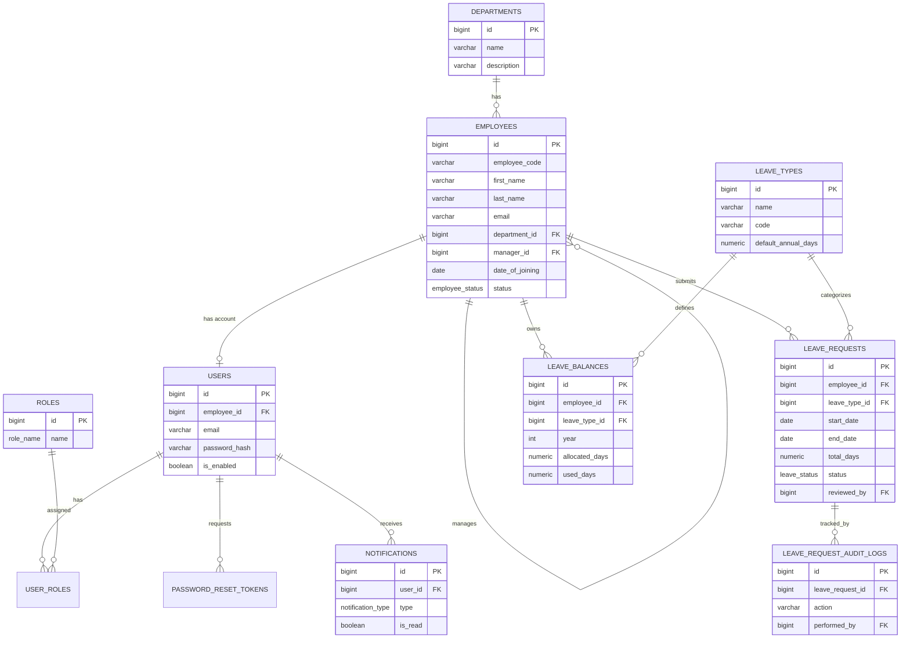

# LeaveFlow Pro — Entity Relationship Diagram

```mermaid
erDiagram
    DEPARTMENTS ||--o{ EMPLOYEES : has
    EMPLOYEES ||--o| USERS : "has account"
    EMPLOYEES ||--o{ EMPLOYEES : manages
    USERS ||--o{ USER_ROLES : has
    ROLES ||--o{ USER_ROLES : assigned
    USERS ||--o{ PASSWORD_RESET_TOKENS : requests
    EMPLOYEES ||--o{ LEAVE_REQUESTS : submits
    LEAVE_TYPES ||--o{ LEAVE_REQUESTS : categorizes
    EMPLOYEES ||--o{ LEAVE_BALANCES : owns
    LEAVE_TYPES ||--o{ LEAVE_BALANCES : defines
    LEAVE_REQUESTS ||--o{ LEAVE_REQUEST_AUDIT_LOGS : tracked_by
    USERS ||--o{ NOTIFICATIONS : receives

    DEPARTMENTS {
        bigint id PK
        varchar name
        varchar description
    }
    EMPLOYEES {
        bigint id PK
        varchar employee_code
        varchar first_name
        varchar last_name
        varchar email
        bigint department_id FK
        bigint manager_id FK
        date date_of_joining
        employee_status status
    }
    USERS {
        bigint id PK
        bigint employee_id FK
        varchar email
        varchar password_hash
        boolean is_enabled
    }
    ROLES {
        bigint id PK
        role_name name
    }
    LEAVE_TYPES {
        bigint id PK
        varchar name
        varchar code
        numeric default_annual_days
    }
    LEAVE_BALANCES {
        bigint id PK
        bigint employee_id FK
        bigint leave_type_id FK
        int year
        numeric allocated_days
        numeric used_days
    }
    LEAVE_REQUESTS {
        bigint id PK
        bigint employee_id FK
        bigint leave_type_id FK
        date start_date
        date end_date
        numeric total_days
        leave_status status
        bigint reviewed_by FK
    }
    LEAVE_REQUEST_AUDIT_LOGS {
        bigint id PK
        bigint leave_request_id FK
        varchar action
        bigint performed_by FK
    }
    NOTIFICATIONS {
        bigint id PK
        bigint user_id FK
        notification_type type
        boolean is_read
    }
```
